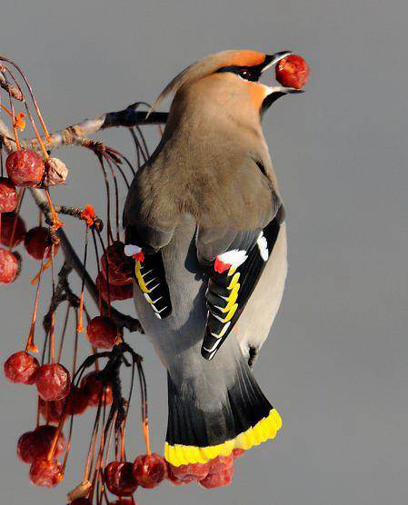
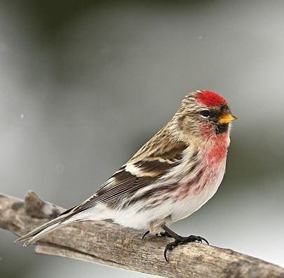
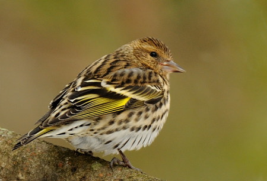
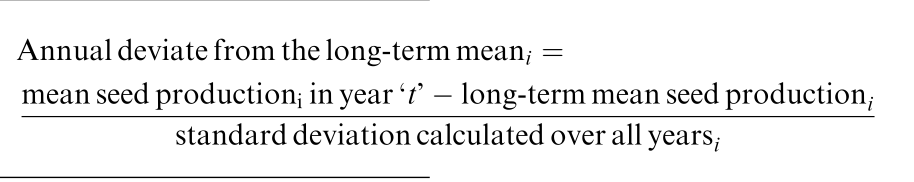

## 

::: {layout-nrow="2"}
{height="280px" fig-align="center"}

{height="280px" fig-align="center"}

{height="280px" fig-align="center"}

{height="280px" fig-align="center"}
:::

## [Hypothèses]{style="color: yellow;"}

1)  Comment évoluent les populations de fringillidés boréaux (4 espèces) dans le temps (1996-2025) ; tendances temporelles sur 30 ans de suivi
    a)  Est-ce que la proportion de jeunes de l’année (indice de succès reproducteur) évolue dans le temps ?
    b)  Comment évolue la condition corporelle des différentes classes au cours du temps ?
2)  Qu'est-ce qui explique les irruptions des différentes espèces de fringillidés ?
    a)  Est-ce que la proportion de jeunes de l’année (indice de succès reproducteur) est corrélée avec l’abondance annuelle?
    b)  Est-ce que la condition corporelle est corrélée à l'abondance annuelle ?

## [Jeu de données brutes]{style="color: yellow;"}

```{r}
library(readxl)
abond <- read_excel("/Users/maxencepoirier-joanette/Rstudio/FOR7046/Abondance.xlsx")
str(abond)
bague <- read_excel("/Users/maxencepoirier-joanette/Rstudio/FOR7046/Baguage.xlsx")
str(bague)
```

## [Dipositif présenté sur R]{style="color: yellow;"}

```{r}
#| echo: true

library(dplyr)

bague <- bague %>%  
  rename(Espece = "Espèce",
         Abrv = "Espèce (abréviation)",
         Age = "Âge",
         Annee = "Année")

# Classe les âges
bague$Age <- replace(bague$Age, bague$Age %in% c("Local", "S"), "U")   #Unknown
bague$Age <- replace(bague$Age, bague$Age %in% "hy", "HY")  #Juv (Hatch year)
bague$Age <- replace(bague$Age, bague$Age %in% c("SY", "ASY", "ahy"), "AHY")  #Non-juv (After-Hatch Year)

# Retire les U
bague <- bague %>% 
  filter(Age != "U") %>% 
  rename(Espece = "Abrv")

#Retirer les colonnes inutiles
bague <- bague %>% 
  select(-Préfixe, -Suffixe, -Site, - Municipalité, -Queue, - Gras, -Date, -Espece, -Sexe) %>%  
  filter(!Annee %in% c(1997,1998, 1999, 2000, 2006))%>%   #Retrait des années avant 2007
  mutate(Condition = (Aile/Masse))                        #Indice de condition standardisé

```

## [Dipositif présenté sur R]{style="color: yellow;"}

```{r}
#| echo: true

abond <- read_excel("/Users/maxencepoirier-joanette/Rstudio/FOR7046/Fringilids/Data/abond_clean.xlsx")
bague <- read_excel("/Users/maxencepoirier-joanette/Rstudio/FOR7046/Fringilids/Data/bague_clean.xlsx")

# Calcul pour la proportion de jeune
props_all <- bague %>%
  group_by(Espece, Annee) %>% # par Abrv et Annee
  summarise(
    nb_HY = sum(Age == "HY"), # somme des jeunes
    nb_AHY = sum(Age == "AHY"), # somme des adultes
    prop_jeunes = nb_HY / (nb_HY + nb_AHY), #proportion de jeunes
    .groups = "drop"
  )

# Données abondance + les proportions de jeunes
abond_joint <- abond %>%
  left_join(props_all, by = c("Espece" = "Espece", "Annee" = "Annee")) %>% 
  mutate(nb_total = nb_HY + nb_AHY) %>% 
  filter(!Annee %in% c(1996,1997,1998, 1999, 2000,2001,2002,2003,2004,2005, 2006))
```

## [Code pour visualisation de l'abondance]{style="color: yellow;"}

```{r}
#| echo: true
library(ggplot2)
library(cowplot)

small_theme <- theme_classic(base_size = 8) +
  theme(
    axis.text.x = element_text(angle = 45, vjust = 0.8, size = 6),
    axis.text.y = element_text(size = 6),
    axis.title = element_text(size = 7),
    plot.title = element_text(size = 8),
    plot.margin = margin(2, 2, 2, 2)
  )

#condition DUSA
plot_DUSA_tot_con <- ggplot(df_clean[df_clean$Espece=="DUSA",], aes(x = Annee, y = Condition_moyenne, group =1))+
  geom_point(size = 3, col = "darkorange1")+
  geom_path(linewidth = 1, col = "orange")+
  geom_errorbar(aes(ymin = Condition_moyenne - Condition_sd, ymax = Condition_moyenne + Condition_sd), width = 0.2) + 
  geom_text(aes(label = nb_total), vjust = -3, size = 3) +
  labs(title = "Durbec des Sapins",
       x = "Année",
       y = "Condition moyenne") +
  theme_classic()+
  theme(axis.text.x = element_text(size = 10, angle = 45, vjust = 0.8))

plot_DUSA_tot_con
  
#conidition SIFL

plot_SIFL_tot_con <- ggplot(df_clean[df_clean$Espece=="SIFL",], aes(x = Annee, y = df_clean_std, group =1))+
  geom_point(size = 3, col = "turquoise4")+
  geom_path(linewidth = 1, col = "turquoise3")+
  labs(title = "Sizerin flammé",
       x = "Année",
       y = expression("N. individus recensés *" ~ heure^{-1}))+
  theme_classic()+
  theme(axis.text.x = element_text(size = 10, angle = 45, vjust = 0.8))

#condition JABO

plot_JABO_tot_con <- ggplot(df_clean[df_clean$Espece=="JABO",], aes(x = Annee, y = df_clean_std, group =1))+
  geom_point(size = 3, col = "darkgreen")+
  geom_path(linewidth = 1, col = "chartreuse4")+
  labs(title = "Jaseur boréal",
       x = "Année",
       y = expression("N. individus recensés *" ~ heure^{-1}))+
  theme_classic()+
  theme(axis.text.x = element_text(size = 10, angle = 45, vjust = 0.8))

#condition TAPI

plot_TAPI_tot_con <- ggplot(df_clean[df_clean$Espece=="TAPI",], aes(x = Annee, y = df_clean_std, group =1))+
  geom_point(size = 3, col = "violetred4")+
  geom_path(linewidth = 1, col = "violetred3")+
  labs(title = "Tarin des pins",
       x = "Année",
       y = expression("N. individus recensés *" ~ heure^{-1}))+
  theme_classic()+
  theme(axis.text.x = element_text(size = 10, angle = 45, vjust = 0.8))
```

```{r}
plot_DUSA_tot_con <- ggplot(df_clean[df_clean$Espece == "DUSA", ],
                            aes(x = Annee, y = Condition_moyenne, group = 1)) +
  
  geom_point(size = 3, col = "darkorange1") +
  geom_path(linewidth = 1, col = "orange") +
  geom_errorbar(aes(ymin = Condition_moyenne - Condition_sd,
                    ymax = Condition_moyenne + Condition_sd),
                width = 0.2) +
  
  # Nombre total AU DESSUS des barres d'erreur
  geom_text(aes(y     = Condition_moyenne + Condition_sd,
                label = paste0("HY:", nb_HY, "\nAHY:", nb_AHY)),
            vjust = -0.5,
            size  = 2.5) +
  
  labs(title = "Durbec des Sapins",
       x     = "Année",
       y     = "Condition moyenne") +
  theme_classic() +
  theme(axis.text.x = element_text(size  = 10,
                                   angle = 45,
                                   vjust = 0.8))
plot_DUSA_tot_con
```

## [Visualisation abondance]{style="color: yellow;"}

```{r}
#| fig-width: 10
#| fig-height: 6
plot_grid(
  plot_DUSA_tot_con,
  plot_JABO_tot_con,
  plot_SIFL_tot_con,
  plot_TAPI_tot_con,
  ncol = 2,
  align = "hv"
)
```

## [Données brutes condition]{style="color: yellow;"}

```{r}
small_theme <- theme_classic(base_size = 8) +
  theme(
    axis.text.x = element_text(angle = 45, vjust = 0.8, size = 6),
    axis.text.y = element_text(size = 6),
    axis.title = element_text(size = 7),
    plot.title = element_text(size = 8),
    plot.margin = margin(2, 2, 2, 2)
  )

# abondance DUSA
plot_DUSA_tot <- ggplot(abond[abond$Espece=="DUSA",], aes(x = Annee, y = abond_std, group =1))+
  geom_point(size = 3, col = "darkorange1")+
  geom_path(linewidth = 1, col = "orange")+
  labs(title = "Durbec des Sapins",
       x = "Année",
       y = expression("N. individus recensés *" ~ heure^{-1}))+
  theme_classic()+
  theme(axis.text.x = element_text(size = 10, angle = 45, vjust = 0.8))

# abondance SIFL

plot_SIFL_tot <- ggplot(abond[abond$Espece=="SIFL",], aes(x = Annee, y = abond_std, group =1))+
  geom_point(size = 3, col = "turquoise4")+
  geom_path(linewidth = 1, col = "turquoise3")+
  labs(title = "Sizerin flammé",
       x = "Année",
       y = expression("N. individus recensés *" ~ heure^{-1}))+
  theme_classic()+
  theme(axis.text.x = element_text(size = 10, angle = 45, vjust = 0.8))

# abondance JABO

plot_JABO_tot <- ggplot(abond[abond$Espece=="JABO",], aes(x = Annee, y = abond_std, group =1))+
  geom_point(size = 3, col = "darkgreen")+
  geom_path(linewidth = 1, col = "chartreuse4")+
  labs(title = "Jaseur boréal",
       x = "Année",
       y = expression("N. individus recensés *" ~ heure^{-1}))+
  theme_classic()+
  theme(axis.text.x = element_text(size = 10, angle = 45, vjust = 0.8))

#abondance TAPI

plot_TAPI_tot <- ggplot(abond[abond$Espece=="TAPI",], aes(x = Annee, y = abond_std, group =1))+
  geom_point(size = 3, col = "violetred4")+
  geom_path(linewidth = 1, col = "violetred3")+
  labs(title = "Tarin des pins",
       x = "Année",
       y = expression("N. individus recensés *" ~ heure^{-1}))+
  theme_classic()+
  theme(axis.text.x = element_text(size = 10, angle = 45, vjust = 0.8))
```

## [Irruption]{style="color: yellow;"}

```{r}
#| echo: true
abond_irruption <- abond %>%
  group_by(Espece) %>% # Par espèce
  mutate( #On créé 6 nouvelles colonnes
    N = abond_std, #valeur de N (mean count)
    P  = mean(abond_std), # valeur de P (valeur prédite)
    numerateur   = N-P, 
    sigma       = sd(numerateur),
    standardized_deviate           = numerateur / sigma,
    seuil = abs(min(standardized_deviate)),
    irruption   = standardized_deviate > seuil
  ) %>%
  ungroup()
```



## [Code pour irruption]{style="color: yellow;"}

```{r}
#| echo: true

# Importer jeu de données pour chaque espèce
DUSA <- abond %>% 
  filter(Espece == "DUSA")

DUSA$Annee <- as.factor(as.numeric(DUSA$Annee))
DUSA$Annee <- as.integer(DUSA$Annee)


# TAPI (Tarin des Pins)
TAPI <- abond %>% 
  filter(Espece == "TAPI")

TAPI$Annee <- as.factor(as.numeric(TAPI$Annee))
TAPI$Annee <- as.integer(TAPI$Annee)

# SIFL (Sizerin flammé)
SIFL <- abond %>% 
  filter(Espece == "SIFL")

SIFL$Annee <- as.factor(as.numeric(SIFL$Annee))
SIFL$Annee <- as.integer(SIFL$Annee)

# JABO (Jaseur Boréal)
JABO <- abond %>% 
  filter(Espece == "JABO")

JABO$Annee <- as.factor(as.numeric(JABO$Annee))
JABO$Annee <- as.integer(JABO$Annee)

```

## [Code pour irruption]{style="color: yellow;"}

```{r}
#| echo: true
# DUSA
DUSA$irruption <- abond_irruption$irruption[abond_irruption$Espece == "DUSA"]
abond_irruption$irruption[abond_irruption$Espece == "DUSA"]
DUSA$irruption <- as.factor(DUSA$irruption)

plot_DUSA_irruption <- ggplot(DUSA, aes(x = Annee, y = abond_std, color = irruption))+
  scale_color_manual(values = c("TRUE" = "orange", "FALSE" = "black"))+
  geom_point(size = 4)+
  geom_path(linewidth = 1, col = "#a7a7a7")+
  labs(title = "Abondance du Durbec des Sapins par heure d'observation",
       x = "Année",
       y = expression("N. individus recensés *" ~ heure^{-1}))+
  geom_hline(yintercept = mean(DUSA$abond_std), col = "red", lty = 2)+
  scale_x_continuous(labels=c('1995', '2005', '2015', '2025'))+
  theme_classic()+
  theme(axis.text.x = element_text(size = 10, angle = 45, vjust = 0.8))

#JABO  
JABO$irruption <- abond_irruption$irruption[abond_irruption$Espece == "JABO"]
#abond_irruption$irruption[abond_irruption$Espece == "JABO"]
JABO$irruption <- as.factor(JABO$irruption)

plot_JABO_irruption <- ggplot(JABO, aes(x = Annee, y = abond_std, color = irruption))+
  scale_color_manual(values = c("TRUE" = "#009929", "FALSE" = "black"))+
  geom_point(size = 4)+
  geom_path(linewidth = 1, col = "#a7a7a7")+
  labs(title = "Abondance du Jaseur boréal par heure d'observation",
       x = "Année",
       y = expression("N. individus recensés *" ~ heure^{-1}))+
  geom_hline(yintercept = mean(JABO$abond_std), col = "red", lty = 2)+
  scale_x_continuous(labels=c('1995', '2005', '2015', '2025'))+
  theme_classic()+
  theme(axis.text.x = element_text(size = 10, angle = 45, vjust = 0.8))


# SIFL
SIFL$irruption <- abond_irruption$irruption[abond_irruption$Espece == "SIFL"]
#abond_irruption$irruption[abond_irruption$Espece == "SIFL"]
SIFL$irruption <- as.factor(SIFL$irruption)

plot_SIFL_irruption <- ggplot(SIFL, aes(x = Annee, y = abond_std, color = irruption))+
  scale_color_manual(values = c("TRUE" = "turquoise", "FALSE" = "black"))+
  geom_point(size = 4)+
  geom_path(linewidth = 1, col = "#a7a7a7")+
  labs(title = "Abondance du Sizerin flammé par heure d'observation",
       x = "Année",
       y = expression("N. individus recensés *" ~ heure^{-1}))+
  geom_hline(yintercept = mean(SIFL$abond_std), col = "red", lty = 2)+
  scale_x_continuous(labels=c('1995', '2005', '2015', '2025'))+
  theme_classic()+
  theme(axis.text.x = element_text(size = 10, angle = 45, vjust = 0.8))


# TAPI
TAPI$irruption <- abond_irruption$irruption[abond_irruption$Espece == "TAPI"]
#abond_irruption$irruption[abond_irruption$Espece == "TAPI"]
TAPI$irruption <- as.factor(TAPI$irruption)

plot_TAPI_irruption <- ggplot(TAPI, aes(x = Annee, y = abond_std, color = irruption))+
  scale_color_manual(values = c("TRUE" = "violetred", "FALSE" = "black"))+
  geom_point(size = 4)+
  geom_path(linewidth = 1, col = "#a7a7a7")+
  labs(title = "Abondance du Tarin des pins par heure d'observation",
       x = "Année",
       y = expression("N. individus recensés *" ~ heure^{-1}))+
  geom_hline(yintercept = mean(TAPI$abond_std), col = "red", lty = 2)+
  scale_x_continuous(labels=c('1995', '2005', '2015', '2025'))+
  theme_classic()+
  theme(axis.text.x = element_text(size = 10, angle = 45, vjust = 0.8))

```

## [Visualisation pour irruption]{style="color: yellow;"}

```{r}
#| fig-width: 10
#| fig-height: 6
plot_grid(plot_DUSA_irruption, 
          plot_JABO_irruption, 
          plot_SIFL_irruption, 
          plot_TAPI_irruption,
            ncol = 2,
          align = "hv")
```

## [Caracétrisation des irruptions]{style="color: yellow;"}

```{r}
#| fig-width: 10
#| fig-height: 6

par(mfrow=c(2,2))

range(abond_irruption$standardized_deviate[abond_irruption$Espece=="DUSA"])
cols=c("black", "orange")

col <- ifelse(abond_irruption$standardized_deviate[abond_irruption$Espece == "DUSA"] > 0.965,
              cols[2],  # vrai ="orange"
              cols[1]   # faux = "black"
)

deviate_dusa<-barplot( abond_irruption$standardized_deviate[abond_irruption$Espece=="DUSA"],
        abond_irruption$Annee[abond_irruption$Espece=="DUSA"],
        xlab= "Année", ylab= "Standard deviate", col= col, 
        main= "Déviation standard du durbec des sapins")
deviate_dusa<-deviate_dusa +abline(h= 0.96, col="red", lty=2)

#plot(abond_irruption$Annee[abond_irruption$Espece=="DUSA"], 
#    abond_irruption$standardized_deviate[abond_irruption$Espece=="DUSA"],
#   xlab= "Année", ylab= "Standard deviate", col= col, pch=20, cex=2 )
#abline(h=0, col="red", lty=2)
#abline(h= 0.96, col="#ff9800")

range(abond_irruption$standardized_deviate[abond_irruption$Espece=="JABO"])
cols=c("black", "darkgreen")

col <- ifelse(abond_irruption$standardized_deviate[abond_irruption$Espece == "JABO"] > 1.053,
              cols[2],  # vrai ="orange"
              cols[1]   # faux = "black"
)

deviate_JABO<-barplot( abond_irruption$standardized_deviate[abond_irruption$Espece=="JABO"],
                       abond_irruption$Annee[abond_irruption$Espece=="JABO"],
                       xlab= "Année", ylab= "Standard deviate", col= col,
                       main= "Déviation standard du jaseur boréal")
deviate_JABO<-deviate_JABO +abline(h= 1.053, col="red", lty=2)


range(abond_irruption$standardized_deviate[abond_irruption$Espece=="SIFL"])
cols=c("black", "turquoise")

col <- ifelse(abond_irruption$standardized_deviate[abond_irruption$Espece == "SIFL"] > 0.495,
              cols[2],  # vrai ="orange"
              cols[1]   # faux = "black"
)

deviate_SIFL<-barplot( abond_irruption$standardized_deviate[abond_irruption$Espece=="SIFL"],
                       abond_irruption$Annee[abond_irruption$Espece=="SIFL"],
                       xlab= "Année", ylab= "Standard deviate", col= col,
                       main= "Déviation standard du sizerin flammé")
deviate_SIFL<-deviate_SIFL +abline(h= 0.495, col="red", lty=2)

range(abond_irruption$standardized_deviate[abond_irruption$Espece=="TAPI"])
cols=c("black", "violet")

col <- ifelse(abond_irruption$standardized_deviate[abond_irruption$Espece == "TAPI"] > 0.525,
              cols[2],  # vrai ="orange"
              cols[1]   # faux = "black"
)

deviate_TAPI<-barplot( abond_irruption$standardized_deviate[abond_irruption$Espece=="TAPI"],
                       abond_irruption$Annee[abond_irruption$Espece=="TAPI"],
                       xlab= "Année", ylab= "Standard deviate", col= col,
                       main= "Déviation standard du tarin des pins")
deviate_TAPI<-deviate_TAPI +abline(h= 0.525, col="red", lty=2)

dev.off()
```

## [Analyse pour les tendances temporelles avec randomisation]{style="color: yellow;"}

```{r}
# Tendance temporelle depuis 1996 - 2025

# SIFL

abond_modif_SIFL <- log(SIFL$abond_std + 1)
abond_modif_SIFL

lm_SIFL <- lm(log(abond_std) ~ Annee, data = SIFL)

summary(lm_SIFL)

par(mfrow = c(2,2))
plot(lm_SIFL)

SIFL_int <- lm_SIFL$coefficients["(Intercept)"]
SIFL_annee <- lm_SIFL$coefficients["Annee"]
SIFL_annee
SIFL_sd <- coef(summary(lm_SIFL))[, "Std. Error"]
SIFL_sd

summary(lm_SIFL)


# Intercepte
upper_ic_SIFL <- SIFL_int + (1.96 * SIFL_sd[1])
lower_ic_SIFL <- SIFL_int - (1.96 * SIFL_sd[1])
lower_ic_SIFL

upper_ic_annee_SIFL <- SIFL_annee + (1.96 * SIFL_sd[2])
upper_ic_annee_SIFL
lower_ic_annee_SIFL <- SIFL_annee - (1.96 * SIFL_sd[2])
lower_ic_annee_SIFL

plot(exp(SIFL_annee),
     ylim = c(0.95, 1.15))
abline(h = 1, lty = 2, col = "red")
segments(x0 = 1, y0 = exp(lower_ic_annee_SIFL),
         x1 = 1, y1 = exp(upper_ic_annee_SIFL))


n_sim <- 5000
SIFL_output <- matrix(data = NA, nrow = n_sim, ncol = 2)
SIFL_sim <- SIFL[, c("Annee")]

set.seed(1234)

for(i in 1:n_sim){
  
  cat("iter = ", i, "\n")
  
  SIFL_sim$abond_std <- sample(x = SIFL$abond_std, replace = FALSE)
  
  lm_SIFL_rand <- lm(log(abond_std) ~ Annee, data = SIFL_sim)
  
  SIFL_output[i,1] <- coef(lm_SIFL_rand)[1] # Beta intercepte (abond_std)
  SIFL_output[i,2] <- coef(lm_SIFL_rand)[2] # Beta année
  
}

SIFL_output

hist(SIFL_output[,1])
hist(SIFL_output[,2])

pbeta_annee <- sum(SIFL_output[, 2] >= coef(lm_SIFL)[2])/n_sim
pbeta_annee

summary(lm_SIFL)

exp(SIFL_annee) # 1,002 oiseau de plus/heure/année 
exp(SIFL_int) 


# GRAPHIQUE

SIFL_log <- ggplot(SIFL, aes(x = Annee, y = log(abond_std), group = 1))+
  geom_point(size = 3, col = "turquoise4")+
  geom_line()+
  geom_abline(intercept = coef(lm_SIFL)[1], slope = coef(lm_SIFL)[2], color = "red")+
  labs(title = "Abondance du Sizerin Flammé par heure d'observation",
       x = "Année",
       y = expression("N. individus recensés *" ~ heure^{-1}))+
  theme_classic()
SIFL_log <- SIFL_log+
  annotate(geom ="text",x = 2000, y = 5, label ="y = 2.35 + 0.025x")

SIFL_log 

# TAPI --------------------------------------------------------------------

abond_modif_TAPI <- log(TAPI$abond_std + 1)
abond_modif_TAPI

lm_TAPI <- lm(log(abond_std) ~ Annee, data = TAPI)

summary(lm_TAPI)

par(mfrow = c(2,2))
plot(lm_TAPI)
dev.off()

TAPI_int <- lm_TAPI$coefficients["(Intercept)"]
TAPI_annee <- lm_TAPI$coefficients["Annee"]
TAPI_annee
TAPI_sd <- coef(summary(lm_TAPI))[, "Std. Error"]
TAPI_sd

summary(lm_TAPI)


# Intercepte
upper_ic_TAPI <- TAPI_int + (1.96 * TAPI_sd[1])
lower_ic_TAPI <- TAPI_int - (1.96 * TAPI_sd[1])
lower_ic_TAPI

upper_ic_annee_TAPI <- TAPI_annee + (1.96 * TAPI_sd[2])
upper_ic_annee_TAPI
lower_ic_annee_TAPI <- TAPI_annee - (1.96 * TAPI_sd[2])
lower_ic_annee_TAPI

plot(exp(TAPI_annee),
     ylim = c(0.95, 1.15))
abline(h = 1, lty = 2, col = "red")
segments(x0 = 1, y0 = exp(lower_ic_annee_TAPI),
         x1 = 1, y1 = exp(upper_ic_annee_TAPI))


n_sim <- 5000
TAPI_output <- matrix(data = NA, nrow = n_sim, ncol = 2)
TAPI_sim <- TAPI[, c("Annee")]

set.seed(1234)

for(i in 1:n_sim){
  
  cat("iter = ", i, "\n")
  
  TAPI_sim$abond_std <- sample(x = TAPI$abond_std, replace = FALSE)
  
  lm_TAPI_rand <- lm(log(abond_std) ~ Annee, data = TAPI_sim)
  
  TAPI_output[i,1] <- coef(lm_TAPI_rand)[1] # Beta intercepte (abond_std)
  TAPI_output[i,2] <- coef(lm_TAPI_rand)[2] # Beta année
  
}

TAPI_output

hist(TAPI_output[,1])
hist(TAPI_output[,2])

pbeta_annee <- sum(TAPI_output[, 2] >= coef(lm_TAPI)[2])/n_sim
pbeta_annee

summary(lm_TAPI)

exp(TAPI_annee) # 1,07 oiseau de plus/heure/année 
exp(TAPI_int) 

# INSERTION GRAPHIQUE

TAPI_log <- ggplot(TAPI, aes(x = Annee, y = log(abond_std), group =1))+
  geom_point(size = 3, col = "violetred4")+
  geom_line()+
  geom_abline(intercept = coef(lm_TAPI)[1], slope = coef(lm_TAPI)[2], color = "red")+
  labs(title = "Abondance du Tarin des Pins par heure d'observation",
       x = "Année",
       y = expression("N. individus recensés *" ~ heure^{-1}))+
  theme_classic()
TAPI_log <- TAPI_log+
  annotate(geom ="text",x = 5, y = 5, label ="y = 1.66 + 0.067x")


# DUSA --------------------------------------------------------------------


abond_modif_DUSA <- log(DUSA$abond_std + 1)
abond_modif_DUSA

lm_DUSA <- lm(log(abond_std) ~ Annee, data = DUSA)

summary(lm_DUSA)

par(mfrow = c(2,2))
plot(lm_DUSA)
dev.off()

DUSA_int <- lm_DUSA$coefficients["(Intercept)"]
DUSA_annee <- lm_DUSA$coefficients["Annee"]
DUSA_annee
DUSA_sd <- coef(summary(lm_DUSA))[, "Std. Error"]
DUSA_sd

summary(lm_DUSA)


# Intercepte
upper_ic_DUSA <- DUSA_int + (1.96 * DUSA_sd[1])
lower_ic_DUSA <- DUSA_int - (1.96 * DUSA_sd[1])
lower_ic_DUSA

upper_ic_annee_DUSA <- DUSA_annee + (1.96 * DUSA_sd[2])
upper_ic_annee_DUSA
lower_ic_annee_DUSA <- DUSA_annee - (1.96 * DUSA_sd[2])
lower_ic_annee_DUSA

plot(exp(DUSA_annee),
     ylim = c(0.95, 1.15))
abline(h = 1, lty = 2, col = "red")
segments(x0 = 1, y0 = exp(lower_ic_annee_DUSA),
         x1 = 1, y1 = exp(upper_ic_annee_DUSA))


n_sim <- 5000
DUSA_output <- matrix(data = NA, nrow = n_sim, ncol = 2)
DUSA_sim <- DUSA[, c("Annee")]

set.seed(0088)

for(i in 1:n_sim){
  
  cat("iter = ", i, "\n")
  
  DUSA_sim$abond_std <- sample(x = DUSA$abond_std, replace = FALSE)
  
  lm_DUSA_rand <- lm(log(abond_std) ~ Annee, data = DUSA_sim)
  
  DUSA_output[i,1] <- coef(lm_DUSA_rand)[1] # Beta intercepte (abond_std)
  DUSA_output[i,2] <- coef(lm_DUSA_rand)[2] # Beta année
  
}

DUSA_output

hist(DUSA_output[,1])
hist(DUSA_output[,2])

pbeta_annee <- sum(DUSA_output[, 2] >= coef(lm_DUSA)[2])/n_sim
pbeta_annee

exp(DUSA_annee) # 1,05 oiseau de plus/heure/année 
exp(DUSA_int) 

val_pred_DUSA <- predict.lm(lm_DUSA)
val_pred_DUSA


coefficients(lm_DUSA)

sigma(lm_DUSA)

# Indice annuelle
coef_irrupt_DUSA <- (DUSA$abond_std - mean(DUSA$abond_std)/sigma(lm_DUSA))
coef_irrupt_DUSA # Lamontagne and Boutin, 2009

# Indice avec valeurs prédites
ind_irrupt_DUSA <- (DUSA$abond_std - val_pred_DUSA)/sigma(lm_DUSA)
ind_irrupt_DUSA # Widick et al., 2023

DUSA$abond_std - mean(DUSA$abond_std)


# GRAPHIQUE

DUSA_log <- ggplot(DUSA, aes(x = Annee, y = log(abond_std), group =1))+
  geom_point(size = 3, col = "darkorange1")+
  geom_line()+
  geom_abline(intercept = coef(lm_DUSA)[1], slope = coef(lm_DUSA)[2], color = "red")+
  labs(title = "Abondance du Durbec des Sapins par heure d'observation",
       x = "Année",
       y = expression("N. individus recensés *" ~ heure^{-1}))+
  theme_classic()
DUSA_log <- DUSA_log+
  annotate(geom ="text",x = 5, y = 5, label ="y = 1.11 + 0.05x")
  

# JABO

# Puisqu'on a une abondance ~ 0 (log(8)) -> +1 sur toutes les données pour éviter 0

abond_modif_JABO <- log(JABO$abond_std + 1)
abond_modif_JABO

lm_JABO <- lm(abond_modif_JABO ~ Annee, data = JABO)

summary(lm_JABO)

par(mfrow = c(2,2))
plot(lm_JABO) # MIEUX!!
dev.off()

JABO_int <- lm_JABO$coefficients["(Intercept)"]
JABO_annee <- lm_JABO$coefficients["Annee"]
JABO_annee
JABO_sd <- coef(summary(lm_JABO))[, "Std. Error"]
JABO_sd


# Intercepte
upper_ic_JABO <- JABO_int + (1.96 * JABO_sd[1])
lower_ic_JABO <- JABO_int - (1.96 * JABO_sd[1])
lower_ic_JABO

upper_ic_annee_JABO <- JABO_annee + (1.96 * JABO_sd[2])
upper_ic_annee_JABO
lower_ic_annee_JABO <- JABO_annee - (1.96 * JABO_sd[2])
lower_ic_annee_JABO

plot(exp(JABO_annee),
     ylim = c(0.95, 1.15))
abline(h = 1, lty = 2, col = "red")
segments(x0 = 1, y0 = exp(lower_ic_annee_JABO),
         x1 = 1, y1 = exp(upper_ic_annee_JABO))

summary(lm_JABO)


n_sim <- 5000
JABO_output <- matrix(data = NA, nrow = n_sim, ncol = 2)
JABO_sim <- JABO[, c("Annee")]

set.seed(5555)

for(i in 1:n_sim){
  
  cat("iter = ", i, "\n")
  
  JABO_sim$abond_std <- sample(x = JABO$abond_std, replace = FALSE)
  
  lm_JABO_rand <- lm(log(abond_std) ~ Annee, data = JABO_sim)
  
  JABO_output[i,1] <- coef(lm_JABO_rand)[1] # Beta intercepte (abond_std)
  JABO_output[i,2] <- coef(lm_JABO_rand)[2] # Beta année
  
}

JABO_output

hist(JABO_output[,1])
hist(JABO_output[,2])

pbeta_annee <- sum(JABO_output[, 2] >= coef(lm_JABO)[2])/n_sim
pbeta_annee

summary(lm_JABO)

exp(JABO_annee) # 1,015 oiseau de plus/heure/année 
exp(JABO_int) 

# GRAPHIQUE
JABO_log <- ggplot(JABO, aes(x = Annee, y = log(abond_std), group =1))+
  geom_point(size = 3, col = "darkgreen")+
  geom_line()+
  geom_abline(intercept = coef(lm_JABO)[1], slope = coef(lm_JABO)[2], color = "red")+
  labs(title = "Abondance du Jaseur Boréal par heure d'observation",
       x = "Année",
       y = expression("N. individus recensés *" ~ heure^{-1}))+
  theme_classic()
JABO_log <- JABO_log+
  annotate(geom ="text",x = 5, y = 5, label ="y = 1.19 + 0.015x")


# Analyse -----------------------------------------------------------------

# Mettre les "prédictions" en un seul graphique

# Combine les 4 graphiques en 2x2
plot_grid(DUSA_log,
          TAPI_log,
          SIFL_log,
          JABO_log, ncol = 2)

tab_comp <- data.frame(c(DUSA_int, JABO_int, TAPI_int, SIFL_int),
                       c(DUSA_annee, JABO_annee, TAPI_annee, SIFL_annee),
                       c(lower_ic_annee_DUSA, lower_ic_annee_JABO, lower_ic_annee_TAPI, lower_ic_annee_SIFL),
                       c(upper_ic_annee_DUSA, upper_ic_annee_JABO, upper_ic_annee_TAPI, upper_ic_annee_SIFL))


rownames(tab_comp) <- c("DUSA", "JABO", "TAPI", "SIFL")
colnames(tab_comp) <- c("Intercepte", "annee", "ic_inf", "ic_sup")

```

## [Figure de l'analyse pour les tendances temporelles avec randomisation]{style="color: yellow;"}

```{r}
#| fig-width: 10
#| fig-height: 6
axex <- 1:4

plot(tab_comp$annee, data = tab_comp,
     xaxt = "n",
     ylim = c(-0.1, 0.15),
     ylab = "log estimé de beta",
     xlab = "Espèces",
     main = "Estimés de log beta avec IC 95%")
abline(h = 0, lty = 2, col = "red")
axis(side = 1, at = axex, labels = c("DUSA", "JABO", "TAPI", "SIFL"))
segments(x0 = 1, y0 = lower_ic_annee_DUSA,
         x1 = 1, y1 = upper_ic_annee_DUSA)
segments(x0 = 2, y0 = lower_ic_annee_JABO,
         x1 = 2, y1 = upper_ic_annee_JABO)
segments(x0 = 3, y0 = lower_ic_annee_TAPI,
         x1 = 3, y1 = upper_ic_annee_TAPI)
segments(x0 = 4, y0 = lower_ic_annee_SIFL,
         x1 = 4, y1 = upper_ic_annee_SIFL)
```

## [Résultats]{style="color: yellow;"}

```{r}

```
